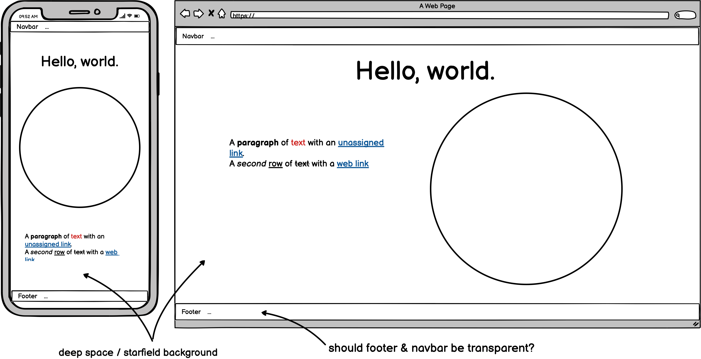

# **Hello, World!**

View the live project [HERE](https://hashim222.github.io/save-earth)

## Overview
Hello, World! is a website for the Code Institute Hackathon to celebrate Earth Day 2022.

The aim of this website Hello, World! is to create awareness of the value of planet Earth and to help bring awareness appreciation in the hope of changing attitudes and behaviours towards our planet.  To allow the user to rethink how we treat and interact and respect our planet. 

To do the above this website presents the user with the idea of terraforming Mars.  This should grab the user’s attention as it should be unexpected for a website with the theme of Earth Day.  The user is given a 3D globe of Mars to interact with.  As the user clicks, they start to learn how inhospitable a planet like Mars is and the almost impossible effort that goes into trying to terraform and create a planet like Earth.

The user is then presented with a 3D globe of Earth to interact with.  This website aims to show the user how perfectly formed the Earth is to support and sustain life and is reminded at the end that the Earth is our home.

There is an abundance of information on how what people can do to care for the Earth and tackle the issues of climate change.  This website tries not to bombard the user with behaviours they must do to care for the Earth and instead attempts to subtly show the user the uniqueness of the planet in order for the user to gain a newfound appreciation and gratitude.  Through this understanding and appreciation, the user is then directed to look inward at their own behaviours and actions.  

According to a study by [Tam (2022)]( https://www.sciencedirect.com/science/article/pii/S0272494421002073), trait gratitude to nature was associated with not only the intention to perform pro-environmental behaviour but also actual donation to environmental causes.

With this research in mind, this website aims to establish gratitude within the user for the Earth in the hopes it leads to environmental behavioural change.

## User Experience (UX)

### User Stories
<!-- /ux -->

## Design

### Design Drawings (Wireframes)
- Main screen layout
<h2 align="center"></h2>

### Fonts

### Colour Scheme
<!-- /design section -->

## Features

This site is intended to suit a Single-Page-Application story-board experience. Other pages not suited to that experience, are
encapsulated in the Root of the directory and linked to in Footer/Nav elements.

The project itself contains HTML/CSS/Javascript and utilises Bootstrap & Google's Model Viewer external Framework/Library links. Model-Viewer
is an Open Source web component developed by Google to showcase WebGL 3D Models in the browser easily, without the need to add a multi-purpose
heavy-hitter Library such as Phaser/ThreeJS.

The 3D models used to identify and visualise the planets were taken from several sources, all credited below, and were manipulated in Blender
to suit the format, size, compression needed for this project.

This project's site map:
* index.html (home)
    * about-us.html
    * privacy-policy.html
    * accessibility.html
    * 404.html
    * 500.html

Custom error pages were created and added to the root, and will detect and throw on error as per Github pages default error handling policy.

While bootstrap was utilised in some structure ordering and component level based inclusion, a lot of the layout of the site was handled with
Flexbox/Grid. We do not float down here....SAY NO TO FLOAT. CSS root variables were utilised to handle any recurring values used throughout, and
the primary body of the CSS file was developed with Mobile First in mind. Media queries were used from `min-width` and up to capture adjustments
for larger than mobile-first screens.

Classes were used for reusable components throughout the DOM, while IDs were utilised for unique single exploit components.

Javasript was light, but important. With some adjustments based on conditions set for the landing experience, with additional Obfuscation in places. 🥚🥚🥚

### Features Left to Implement

## Testing

This site was tested in a manual environment by each developer prior to PR submissions. This meant that each PR was submitted to the pipeline for
review and sanity checks by peers in the team, were maintained in good faith by the submitting Developer.

Each PR was carefully reviewed in detail, and when necessarym dialog was opened with heavy focus on continuous communication amongst the team
for Merge Conflicts, adjustments, or confirmations etc.

### Interesting Issues & Bugs Found

## Deployment

The site was deployed to GitHub pages. The steps to deploy are as follows:

* In the GitHub repository, navigate to the Settings tab.

* On the left hand side menu, choose Pages.

* From the source section drop-down menu, select the Main branch and then press Save.

* The next page will displlay a notice stating the site is ready to be published. 

* Refresh GitHub and the display will now state the site is published.

* Visual Studio (VS) Code & GitPod were the Integrated Development Environments used bby the team to develop this website.

### Version Control
1.	The main repository was forked by all collaborators
2.	Branch protection was added to ensure pull requests were reviewed before merging
3.	Each team member ensured their development environment was linked by using the command:  git remote -v 
4.	For each new feature, team members created a new branch: git checkout -b branch-name
5.	To ensure this branch was being tracked: git push -u origin branch-name
6.	 In order to update the project files in their own work space:  git pull upstream main this was important to limit the amount of merge conflicts a team member came across
7.	Each team member used git add . git commit and git push to add, stage and save their work to their branch. 
8.	When a team member finished a feature they made a Pull Request.  A template was used for this Pull Request so all team members information was structured the same.  This Pull Request was then checked by another member of the team.  If a merge conflict arose the team member would be notified by a comment otherwise the branch was merged.

### Cloning
To clone this repository from [GitHub](www.github.com) to a local computer to make it easier to fix merge conflicts, add or remove files, and push larger commits or contribute use the following steps:

1. On [GitHub](www.github.com), navigate to the main page of the repository.

2. Above the list of files, click Code.

3. click Use GitHub CLI, then the copy icon.

4. Open Git Bash and change the current working directory to the location where you want the cloned directory.

5. Type git clone, and then paste the URL that was copied from step 3 above.

6. Press Enter to create the local clone.

## Credits

*   Tam (2022), Gratitude to nature: Presenting a theory of its conceptualization, measurement, and effects on pro-environmental behavior. [ScienceDirect]( https://www.sciencedirect.com/science/article/pii/S0272494421002073)

### Media
   * The favicon Image for this website was taken from [PngWing Website](https://www.pngwing.com/)
   * https://solarsystem.nasa.gov/resources/2392/earth-with-clouds-3d-model/
   * https://www.pngall.com/rocket-png

*   To create the privacy policy for the site, we used the [Privacy Policy Generator](https://www.privacypolicygenerator.info/)
### Content Research
**Mars**
*   Natural History Museum - [It's Offical: we can't terraform Mars](https://www.nhm.ac.uk/discover/news/2018/july/its-official-we-cant-terraform-mars.html)

*   Wikipedia - [Terraformng Mars](https://en.wikipedia.org/wiki/Terraforming_of_Mars)

*   How Stuff Works - [Creating a Martian Greenhouse](https://science.howstuffworks.com/terraforming2.htm)

*   Universe Today - [How Strong is the Gravity on Mars?](https://www.universetoday.com/14859/gravity-on-mars/)

*   Wired - [The Strange, Deadly Effects Mars Would Have on Your Body](https://www.wired.com/2014/02/happens-body-mars/)

*   Universe Today - [An Absolutely Bonkers Plan to Give Mars an Artificial Magnetosphere](https://www.universetoday.com/153368/an-absolutely-bonkers-plan-to-give-mars-an-artificial-magnetosphere/)

*   Planetary Society - [Can We Make Mars Earth-Like Through Terraforming?](https://www.planetary.org/articles/can-we-make-mars-earth-like-through-terraforming)

*   Interesting Engineering - [Making Mars Habitable: Researchers Propose a Localized Alternative to Terraforming](https://interestingengineering.com/making-mars-habitable-researchers-propose-a-localized-alternative-to-terraforming)

**Earth**

*   National Geographic - [Planet Earth, Explained](https://www.nationalgeographic.com/science/article/earth)

*   NASA Science - [How Big is the Solar System](https://solarsystem.nasa.gov/news/1164/how-big-is-the-solar-system/#:~:text=Scientists%20sometimes%20call%20our%20region,of%20our%20imaginary%20football%20field.)

*   Parade - [What a Wonderful World: Earth Facts](https://parade.com/1331806/stephanieosmanski/facts-about-earth/)

*   National Geographic - [The Sun](https://www.nationalgeographic.org/encyclopedia/sun/)

*   NBC - [What Makes Earth so Special](https://www.nbcnews.com/id/wbna25587911)

### Media
   * The favicon Image for this website was taken from [PngWing Website](https://www.pngwing.com/)

## Acknowledgements
